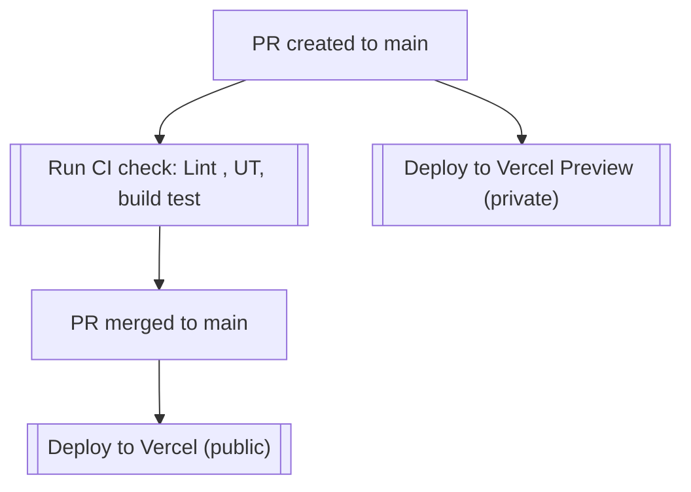
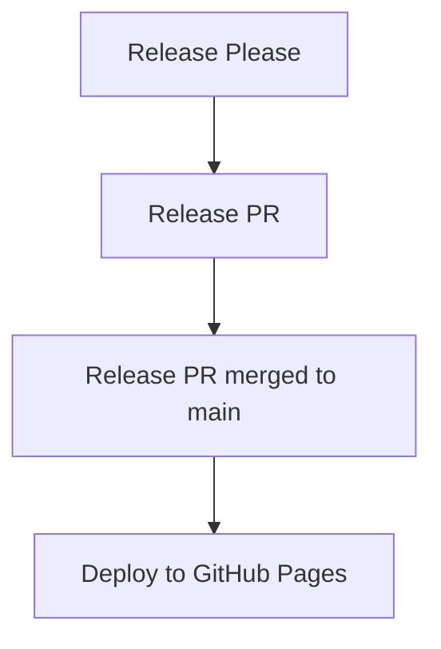

# Contributor Guide

Welcome to the Prayer Blog project! We appreciate your interest in contributing. This guide outlines the process for contributing both as a developer and as a non-developer.

Join us in the [Discord](https://discord.gg/SWRHyas2) to discuss the project.

---

## Developer Contribution Guide

### Getting Started

Prepare the project:

```bash
npm install
npm run prepare
```

First, run the development server:

```bash
npm run dev
```

Open [http://localhost:3000](http://localhost:3000) with your browser to see the result.

### 1. Contribution Process

To contribute as a developer:

1. **Fork the Repository**: Start by forking the repository to your own GitHub account.
2. **Clone Your Fork**:
   ```bash
   git clone https://github.com/<your-username>/prayer-blog.git
   cd prayer-blog
   ```
3. **Create a Branch**:

   - Use the following naming convention for your branch:
     ```
     <type>/<short-description>
     ```
     For example:
     - `feat/add-new-prayer-page`
     - `fix/prayer-edit-bug`

   ```bash
   git checkout -b feat/your-feature-name
   ```

4. **Commit Changes**: Follow the [Conventional Commits](https://www.conventionalcommits.org/en/v1.0.0/) guidelines:

   ```
   <type>: <short summary>
   ```

   Examples:

   - `feat: add new prayer entry feature`
   - `fix: resolve bug in edit prayer form`

   **Conventional Commit Types**:

   - `feat`: A new feature.
   - `fix`: A bug fix.
   - `docs`: Documentation changes.
   - Refer to [release please config](https://github.com/schwannden/prayer-blog/blob/main/release-please-config.json#L12) for more types.

5. **Push Your Changes**:

   ```bash
   git push origin feat/your-feature-name
   ```

6. **Create a Pull Request (PR)**:
   - Go to the original repository: [Prayer Blog](https://github.com/schwannden/prayer-blog)
   - Click "New Pull Request".
   - Provide a clear description of your changes.

## Extend / Customize

`data/siteMetadata.js` - contains most of the site related information which should be modified for a user's need.

`data/authors/default.md` - default author information (required). Additional authors can be added as files in `data/authors`.

`data/projectsData.js` - data used to generate styled card on the projects page.

`data/headerNavLinks.js` - navigation links.

`data/logo.svg` - replace with your own logo.

`data/prayer` - replace with your own blog posts.

`public/static` - store assets such as images and favicons.

`tailwind.config.js` and `css/tailwind.css` - tailwind configuration and stylesheet which can be modified to change the overall look and feel of the site.

`css/prism.css` - controls the styles associated with the code blocks. Feel free to customize it and use your preferred prismjs theme e.g. [prism themes](https://github.com/PrismJS/prism-themes).

`contentlayer.config.ts` - configuration for Contentlayer, including definition of content sources and MDX plugins used. See [Contentlayer documentation](https://www.contentlayer.dev/docs/getting-started) for more information.

`components/MDXComponents.js` - pass your own JSX code or React component by specifying it over here. You can then use them directly in the `.mdx` or `.md` file. By default, a custom link, `next/image` component and table of contents component are passed down. Note that the components should be default exported to avoid [existing issues with Next.js](https://github.com/vercel/next.js/issues/51593).

`layouts` - main templates used in pages:

- There are currently 3 post layouts available: `PostLayout`, `PostSimple` and `PostBanner`. `PostLayout` is the default 2 column layout with meta and author information. `PostSimple` is a simplified version of `PostLayout`, while `PostBanner` features a banner image.
- There are 2 blog listing layouts: `ListLayout`, the layout used in version 1 of the template with a search bar and `ListLayoutWithTags`, currently used in version 2, which omits the search bar but includes a sidebar with information on the tags.

`app` - pages to route to. Read the [Next.js documentation](https://nextjs.org/docs/app) for more information.

`next.config.js` - configuration related to Next.js. You need to adapt the Content Security Policy if you want to load scripts, images etc. from other domains.

## Post

Content is modelled using [Contentlayer](https://www.contentlayer.dev/), which allows you to define your own content schema and use it to generate typed content objects. See [Contentlayer documentation](https://www.contentlayer.dev/docs/getting-started) for more information.

### Frontmatter

Frontmatter follows [Hugo's standards](https://gohugo.io/content-management/front-matter/).

Please refer to `contentlayer.config.ts` for an up to date list of supported fields. The following fields are supported:

```
title (required)
date (required)
tags (optional)
lastmod (optional)
draft (optional)
summary (optional)
images (optional)
authors (optional list which should correspond to the file names in `data/authors`. Uses `default` if none is specified)
layout (optional list which should correspond to the file names in `data/layouts`)
canonicalUrl (optional, canonical url for the post for SEO)
```

Here's an example of a post's frontmatter:

```
---
title: 'Introducing Tailwind Nexjs Starter Blog'
date: '2021-01-12'
lastmod: '2021-01-18'
tags: ['next-js', 'tailwind', 'guide']
draft: false
summary: 'Looking for a performant, out of the box template, with all the best in web technology to support your blogging needs? Checkout the Tailwind Nextjs Starter Blog template.'
images: ['/static/images/canada/mountains.jpg', '/static/images/canada/toronto.jpg']
authors: ['default', 'sparrowhawk']
layout: PostLayout
canonicalUrl: https://tailwind-nextjs-starter-blog.vercel.app/blog/introducing-tailwind-nextjs-starter-blog
---
```

---

## Deploy Strategy

### Preview Environment



### Production Environment



---

## Non-Developer Contribution Guide

If you aren't coding but still want to help, please contribute by reporting issues or suggesting ideas!

1. **Go to Issues**:

   - Navigate to the [Issues Tab](https://github.com/schwannden/prayer-blog/issues).
   - Search for existing issues or [create a new one](https://github.com/schwannden/prayer-blog/issues/new/choose).

2. **Create a New Issue**:

   - Select the appropriate issue type:

     - 🐛 **Bug Report**: Report any bugs or unexpected behavior.
     - ✨ **Feature Request**: Suggest a new feature or improvement.
     - 🙏 **New Prayer Contribution**: Share new prayers to be added to the blog.

   - Fill out the issue template clearly and provide as much detail as possible.

---

Thank you for helping make the Prayer Blog better! 🌟
